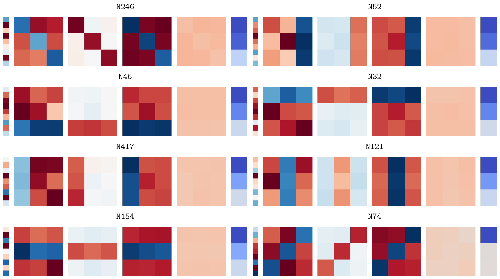

# TicTacGPT

TicTacGPT is a one-layer transformer model that is trained to model random Tic-Tac-Toe game sequences. This project fully reverse engineers TicTacGPT and identifies the input and output circuits of each neuron to understand how the model makes its predictions.

The write-up for this project is at [report/build/main.pdf](report/build/main.pdf).

## Interesting findings

1. TicTacGPT uses constant, chequerboard-like patterns. The first attention head attends to the moves played by the current player, while the second head attends to the moves played by the opponent.
2. The skip connection around the MLP is almost entirely unused. In other words, most of the predictions are made directly by the MLP block (i.e. the neurons).
3. 30% of the neurons are responsible for nearly all of the model's predictions.
4. Of the 30% of neurons, most of them have an interpretable meaning. I identified the following classes of neurons:
   1. "X wins" neurons: These neurons that activate when X wins the game.
   2. "O wins" neurons: These neurons that activate when O wins the game.
   3. "Draw" neurons: These neurons that activate when the game ends in a draw.
   4. "Single move suppression" neurons: These neurons that suppress the logits of moves that have already been played.
   5. "Multi-move suppression" neurons: These neurons that suppress the logits of combinations of moves when some/all of the moves have already been played.
   6. "Anti-win" neurons: These neurons that suppress the logits of moves that would result in an immediate win.
   7. "Positional" neurons: These neurons that activate based on the turn number of the game.

## Neurons that identify wins for X

